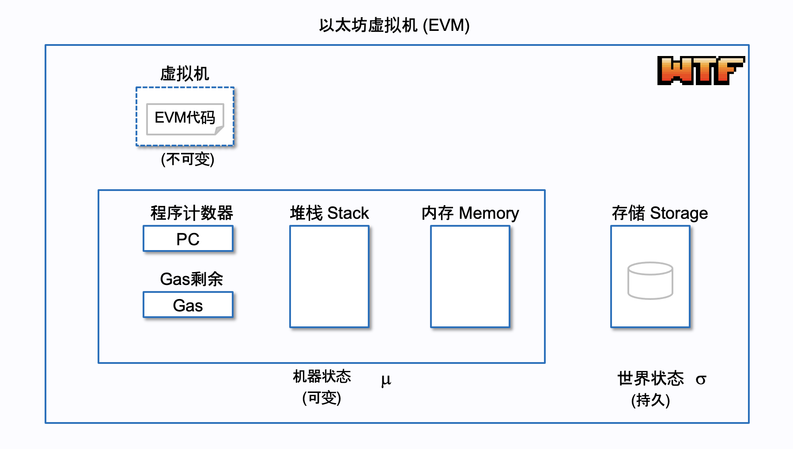
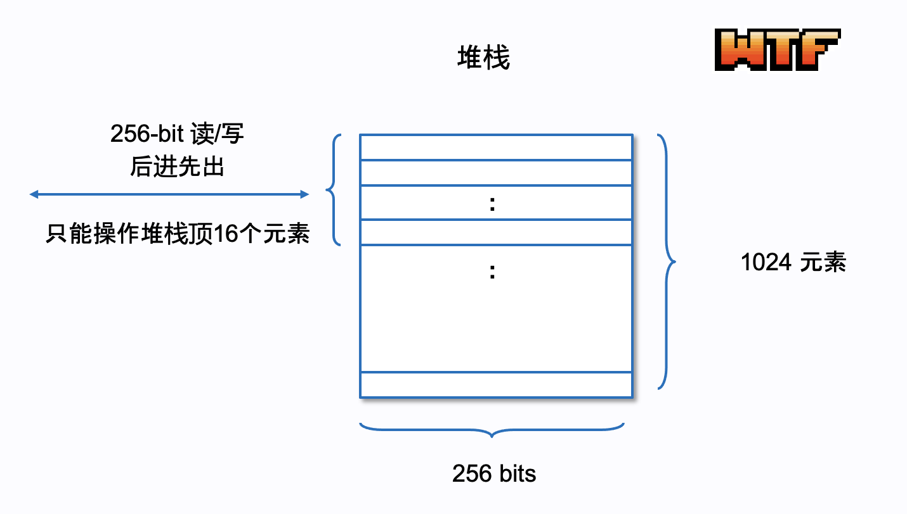

# WTF Opcodes极简入门: 1. Hello Opcodes

我最近在重新学以太坊opcodes，也写一个“WTF EVM Opcodes极简入门”，供小白们使用。

推特：[@0xAA_Science](https://twitter.com/0xAA_Science)

社区：[Discord](https://discord.gg/5akcruXrsk)｜[微信群](https://docs.google.com/forms/d/e/1FAIpQLSe4KGT8Sh6sJ7hedQRuIYirOoZK_85miz3dw7vA1-YjodgJ-A/viewform?usp=sf_link)｜[官网 wtf.academy](https://wtf.academy)

所有代码和教程开源在github: [github.com/WTFAcademy/WTF-Opcodes](https://github.com/WTFAcademy/WTF-Opcodes)

-----

这一讲，我们将介绍Opcodes和EVM基础，为之后的课程做准备。

## Opcodes 简介

Opcodes（操作码）是以太坊智能合约的基本单元。大家写的Solidity智能合约会被编译为字节码（bytecode），然后才能在EVM（以太坊虚拟机）上运行。而字节码就是由一系列Opcodes组成的。当用户在EVM中调用这个智能合约的函数时，EVM会解析并执行这些Opcodes，以实现合约逻辑。

例如，我们看一下几个常见的Opcodes：
- `PUSH1`: 将一个字节的数据压入堆栈。例如，`PUSH1 0x60` 就是将 0x60 压入堆栈。
- `DUP1`: 复制堆栈顶部的一个元素。
- `SWAP1`: 交换堆栈顶部的前两个元素。

下面是一个简单的Solidity智能合约，它只有一个`add()`函数，计算`1+1`的结果并返回。

```solidity
// SPDX-License-Identifier: MIT
pragma solidity ^0.8.20;

contract Add {
    function add() public pure returns (uint256 result) {
        result = 1+1;
    }
}
```

将合约编译后，我们可以得到合约对应的bytecode:

```
60806040523480156100...
```

通过bytecode，我们可以得到合约对应的opcodes为:

```
PUSH1 0x80 PUSH1 0x40 MSTORE CALLVALUE DUP1 ...
```

如果你想理解这些opcodes在做什么，那么这个教程就适合你，那我们现在开始吧。

## EVM 基础

由于Opcodes直接操作EVM的资源，比如堆栈、内存、存储，因此了解EVM基础很重要。

类似Java的JVM，以太坊智能合约的运行时环境就是EVM。EVM的基本架构主要包括堆栈，内存，存储，EVM字节码，和燃料费，下面我们逐个讲解：



### 1. 堆栈 Stack

EVM是基于堆栈的，这意味着它处理数据的方式是使用堆栈数据结构进行大多数计算。堆栈是一种“后进先出”（LIFO）的数据结构，高效而简洁。你可以把它想像成一叠盘子，当你需要添加一个盘子时，你只能把它放在堆栈的最上面，我们把这个动作叫压入`PUSH`；而当你需要取一个盘子时，你只能取最上面的那一个，我们称之为弹出`POP`。许多操作码涉及将数据压入堆栈或从堆栈弹出数据。

在堆栈中，每个元素长度为256位（32字节），最大深度为1024元素，但是每个操作只能操作堆栈顶的16个元素。这也是为什么有时Solidity会报`Stack too deep`错误。



### 2. 内存 Memory

堆栈虽然计算高效，但是存储能力有限，因此EVM使用内存来支持交易执行期间的数据存储和读取。EVM的内存是一个线性寻址存储器，你可以把它理解为一个动态字节数组，可以根据需要动态扩展。它支持以8或256 bit写入（`MSTORE8`/`MSTORE`），但只支持以256 bit读取（`MLOAD`）。

需要注意的是，EVM的内存是“易失性”的：交易开始时，所有内存位置的值均为0；交易执行期间，值被更新；交易结束时，内存中的所有数据都会被清除，不会被持久化。如果需要永久保存数据，就需要使用EVM的存储


### 3. 存储 Storage

EVM的账户存储（Account Storage）是一种映射（mapping，键值对存储），每个键和值都是256 bit的数据，它支持256 bit的读和写。这种存储在每个合约账户上都存在，并且是持久的，它的数据会保持在区块链上，直到被明确地修改。

对存储的读取（`SLOAD`）和写入（`SSTORE`）都需要gas，并且比内存操作更昂贵。这样设计可以防止滥用存储资源，因为所有的存储数据都需要在每个以太坊节点上保存。


### 4. EVM 字节码

我们之前提到，Solidity智能合约会被编译为EVM字节码，然后才能在EVM上运行。这个字节码是由一系列的Opcodes组成的，通常表现为一串十六进制的数字。EVM字节码在执行的时候，会按照顺序一个一个地读取并执行每个Opcode。

例如，字节码`6001600101`可以被解码为：

```
PUSH1 0x01
PUSH1 0x01
ADD
```

这段Opcodes的含义是将两个1相加，得到结果2。


### 5. Gas

Gas是以太坊中执行交易和运行合约的"燃料"。每个交易或合约调用都需要消耗一定数量的Gas，这个数量取决于它们进行的计算的复杂性和数据存储的大小。

EVM上每笔交易的gas是如何计算的呢？其实是通过opcodes。以太坊规定了每个opcode的gas消耗，复杂度越高的opcodes消耗越多的gas，比如：
- `ADD`操作消耗3 gas
- `SSTORE`操作消耗20000 gas
- `SLOAD`操作消耗200 Gas

一笔交易的gas消耗等于其中所有opcodes的gas成本总和。当你调用一个合约函数时，你需要预估这个函数执行所需要的Gas，并在交易中提供足够的Gas。如果提供的Gas不够，那么函数执行会在中途停止，已经消耗的Gas不会退回。


### 6. 执行模型

最后，咱们串联一下以上的内容，介绍EVM的执行模型。它可以概括为以下步骤：

1. 当一个交易被接收并准备执行时，以太坊会初始化一个新的执行环境并加载合约的字节码。

2. 字节码被翻译成Opcode，被逐一执行。每个Opcodes代表一种操作，比如算术运算、逻辑运算、存储操作或者跳转到其他操作码。

3. 每执行一个Opcodes，都要消耗一定数量的Gas。如果Gas耗尽或者执行出错，执行就会立即停止，所有的状态改变（除了已经消耗的Gas）都会被回滚。

4. 执行完成后，交易的结果会被记录在区块链上，包括Gas的消耗、交易日志等信息。


## 总结

这一讲，我们介绍了EVM和Opcodes的基础知识，在之后的教程中，我们将继续学习Opcodes！
