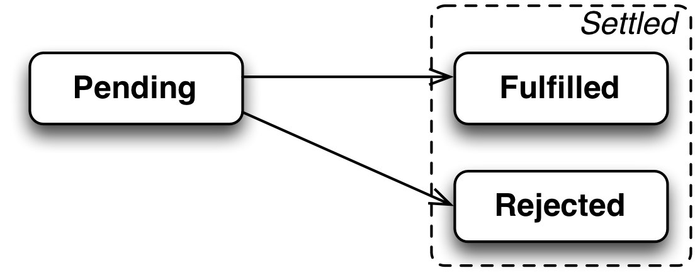

# WTF JavaScript 极简教程 21. Promise

WTF JavaScript 教程，帮助新人快速入门 JavaScript。

**推特**：[@WTFAcademy_](https://twitter.com/WTFAcademy_) ｜ [@0xAA_Science](https://twitter.com/0xAA_Science)

**WTF Academy 社群：** [官网 wtf.academy](https://wtf.academy/) | [WTF Solidity 教程](https://github.com/AmazingAng/WTFSolidity) | [discord](https://discord.gg/5akcruXrsk/) | [微信群申请](https://docs.google.com/forms/d/e/1FAIpQLSe4KGT8Sh6sJ7hedQRuIYirOoZK_85miz3dw7vA1-YjodgJ-A/viewform?usp=sf_link)

所有代码和教程开源在 github: [github.com/WTFAcademy/WTF-Javascript](https://github.com/WTFAcademy/WTF-Javascript)

---

JavaScript 是一种异步编程语言，这意味着它可以在等待某个操作（如网络请求）完成的同时，执行其他任务。在第10讲，我们介绍了异步编程和 `async/await`语法糖，这一讲，我们介绍 Promise（承诺）。

## 什么是 Promise？

Promise 是一种在 JavaScript 中处理异步操作的方法，让异步代码更易于理解和管理。它代表一个未来可能会得到的结果的对象，可能是一个成功的值，或者一个发生的错误。Promise 在它们被解析（resolve，代表成功）或拒绝（reject，代表失败）之前，处于待定（pending）状态。

以下是 Promise 的三种状态：

- **待定（Pending）**：初始状态，既不是成功，也不是失败。
- **已实现（Fulfilled）**：操作成功完成。
- **已拒绝（Rejected）**：操作失败。

Promise 是一次性的 —— 它们只能从待定状态转移到实现或拒绝状态，一旦改变，状态就无法再次改变。这意味着，如果一个 Promise 被解析，你就不能再次解析或拒绝它，反之亦然。



- JavaScript程序: 我知道你现在还没准备好（Pending），但你能不能给我一个承诺（Promise）？
- 0xAA: 好的，我给你一个承诺（Promise），等我准备好的时候，我会调用你的 `resolve` 回调函数；但是如果准备失败，我会调用你的 `reject` 回调函数，并告诉你失败的原因。

## 创建 Promise

在 JavaScript 中，你可以使用 `new Promise` 构造函数创建一个新的 Promise，该构造函数接收一个函数作为参数，这个函数又接收两个参数：一个 `resolve` 函数和一个 `reject` 函数，分别用于改变 Promise 的状态为 Fulfilled 或 Rejected。

```javascript
const promise = new Promise((resolve, reject) => {
  // 异步操作代码
});
```

在执行器函数内部，我们通常会进行一些异步操作，例如读取文件、发起网络请求等。当异步操作成功完成，我们调用 `resolve` 函数并传入结果值，当操作失败时，我们调用 `reject` 函数并传入错误。

例如，以下是一个简单的 Promise，它使用 `setTimeout` 来模拟异步操作：

```javascript
const promise = new Promise((resolve, reject) => {
  setTimeout(() => {
    resolve('WTF Promise resolved');
  }, 1000);
});

// 1秒后输出 'WTF Promise resolved'
promise.then(value => console.log(value));
```

在上述代码中，我们创建了一个新的 Promise，它将在 1 秒后被解析，并返回字符串 `'Promise resolved'`。我们使用 `.then` 方法注册了一个回调函数，当 Promise 解析时，该函数将被调用并接收解析的值。

## 使用 Promise

Promise 的优势在于你可以使用链式 `.then` 调用来组织和管理你的异步代码。`.then` 方法接受两个可选参数：一个用于处理解析值的回调函数，和一个用于处理拒绝原因（即错误）的回调函数。

```js
promise.then(
  value => {
    // 处理解析后的值
  },
  error => {
    // 处理错误
  }
);
```

`.then` 方法返回一个新的 Promise，这使得你可以将多个 `.then` 调用链接在一起。

```javascript
promise
  .then(value => {
    console.log(value);
    return value + ' WTF';
  })
  .then(newValue => console.log(newValue));
```

`.catch` 方法可以用来捕获错误。它和 `.then` 方法类似，都返回一个新的 Promise。你可以将它们链接在一起，如果其中一个 Promise 被拒绝，`catch` 会处理它：

```js
promise
  .then(value => {
    throw new Error('WTF Something went wrong');
  })
  .catch(error => console.error(error));
```

在这个例子中，我们首先在 `then` 方法中处理解析值，然后在 `catch` 方法中处理错误。这是一种常见的错误处理模式。

`finally` 方法不管 `Promise` 对象最后状态如何，都会被执行。`finally` 方法的回调函数不接受任何参数，这意味着没有办法知道，前面的 `Promise` 状态到底是 `resolved` 还是 `rejected`。这表明，`finally` 方法里面的操作，应该是与状态无关的，不依赖于 `Promise` 的执行结果。

```js
const p = new Promise((resolve, reject) => {
  resolve('Hello, WTF JavaScript!')
})

p.then((value) => {
  console.log(value)
}).finally(() => {
  console.log('finally')
})

// Hello, WTF JavaScript!
// finally
```

## Promise API

Promise API 提供了一些用于处理 Promise 的便捷方法：

- `Promise.resolve(value)`：返回一个以给定值解析后的 Promise。如果该值是一个 Promise，返回的 Promise 将具有相同的状态和值。
- `Promise.reject(reason)`：返回一个用给定的原因拒绝的 Promise。
- `Promise.all(iterable)`：返回一个新的 Promise，它在 iterable 中的所有 Promise 都解析后解析，或者在 iterable 中的任何 Promise 被拒绝后拒绝。
- `Promise.race(iterable)`：返回一个新的 Promise，它在 iterable 中的任何 Promise 解析或拒绝后具有相同的解析值或拒绝原因。
- `Promise.allSettled(iterable)`: 有时我们希望等到一组异步操作都结束了，不管每一个操作是成功还是失败，再进行下一步操作。但是，`Promise.all` 方法只适合所有异步操作都成功的情况，如果有一个操作失败，就无法满足要求。这时我们需要使用 `Promise.allSettled` 方法。
- `Promise.any`: 与 `Promise.race` 类似，区别在于只要有一个 `Promise` 实例变成 `fulfilled` 状态，包装实例就会变成 `fulfilled` 状态；所有 `Promise` 实例都变成 `rejected` 状态，包装实例才会变成 `rejected` 状态。


## 高级 Promise 模式

在处理复杂的异步操作时，我们可能需要使用一些更高级的 Promise 模式。

- **链式 Promise**：`then` 和 `catch` 方法都会返回新的 Promise，这使我们可以创建一个 Promise 链，依次处理多个异步操作。

```javascript
fetch('https://api.example.com/data') // 返回一个 Promise
  .then(response => response.json()) // 返回一个新的 Promise
  .then(data => console.log(data)) // 返回一个新的 Promise
  .catch(error => console.error(error)); // 返回一个新的 Promise
```

- **并行 Promise**：使用 `Promise.all` 或 `Promise.race` 方法，我们可以并行执行多个 Promise，并按照它们的解析顺序或速度来解析最终的 Promise。

```javascript
Promise.all([
  fetch('https://api.example.com/data1'),
  fetch('https://api.example.com/data2')
])
  .then(([response1, response2]) => Promise.all([response1.json(), response2.json()]))
  .then(([data1, data2]) => {
    console.log('Data 1:', data1);
    console.log('Data 2:', data2);
  })
  .catch(error => console.error(error));
```

在这个例子中，我们并行获取两个 API 的数据，然后同时处理两个响应。

## 总结

这一讲，我们介绍了 JavaScript 中的一个重要概念，Promise，方便我们处理异步操作。通过深入理解和使用 Promise，你可以写出更干净、更容易维护的异步代码。