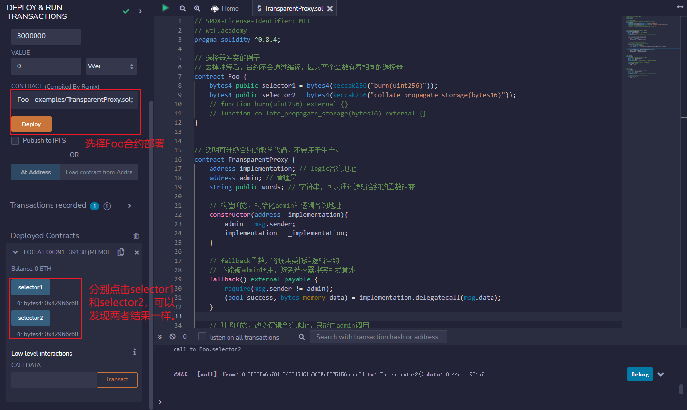
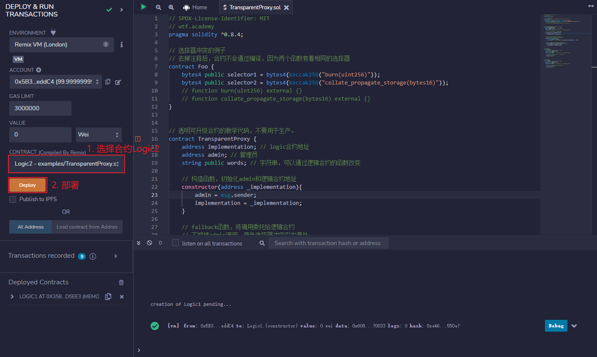
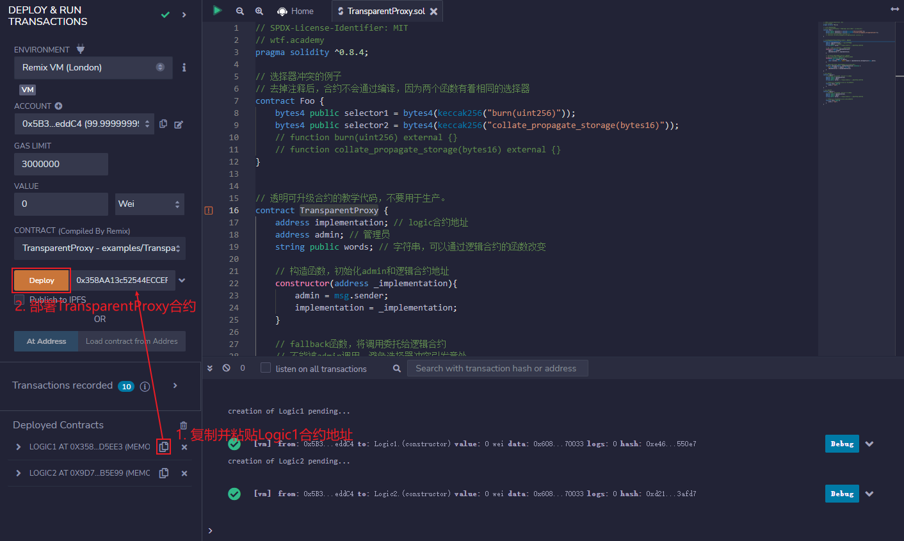
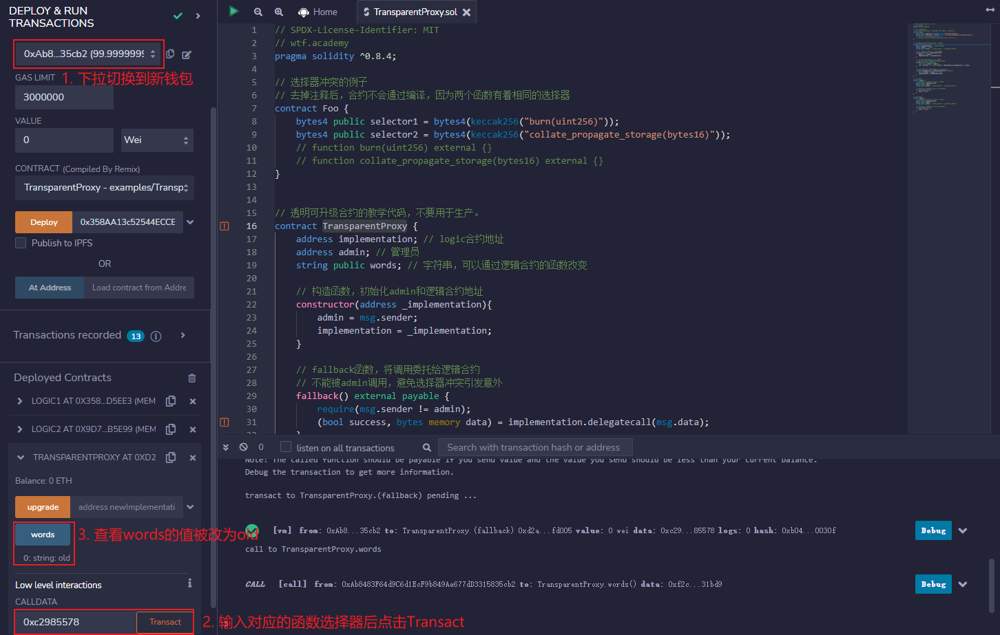
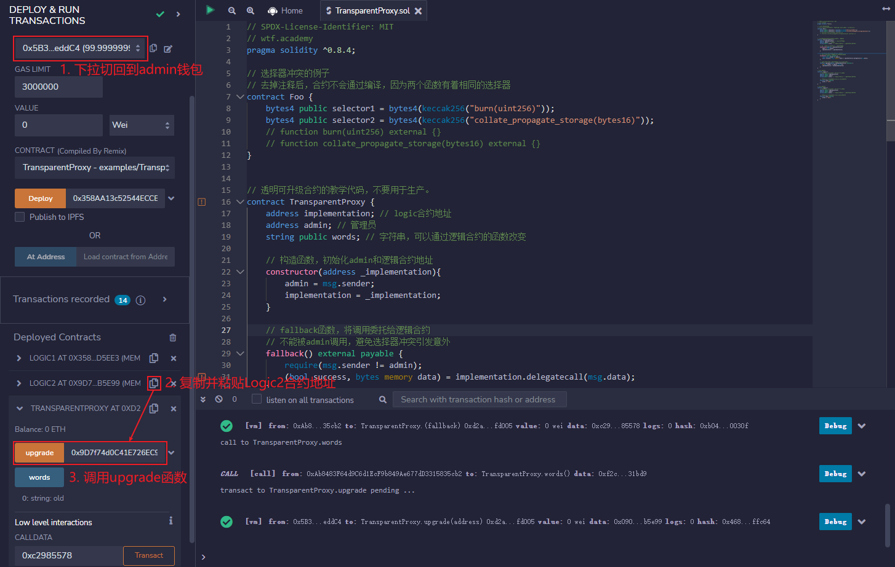
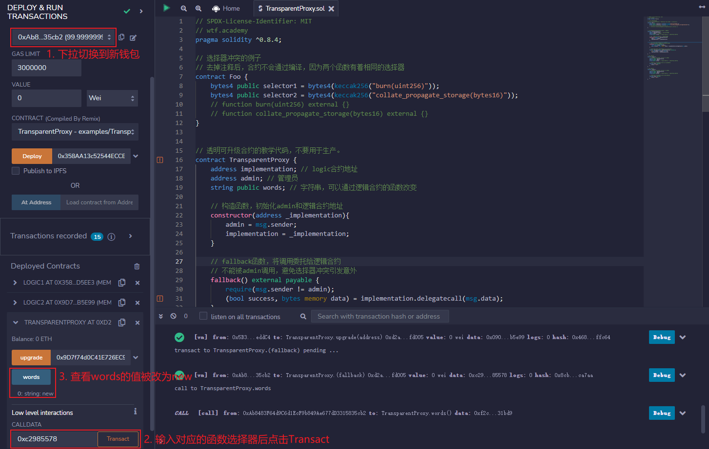

# WTF Solidity极简入门: 48. 透明代理

我最近在重新学solidity，巩固一下细节，也写一个“WTF Solidity极简入门”，供小白们使用（编程大佬可以另找教程），每周更新1-3讲。

推特：[@0xAA_Science](https://twitter.com/0xAA_Science)

社区：[Discord](https://discord.gg/5akcruXrsk)｜[微信群](https://docs.google.com/forms/d/e/1FAIpQLSe4KGT8Sh6sJ7hedQRuIYirOoZK_85miz3dw7vA1-YjodgJ-A/viewform?usp=sf_link)｜[官网 wtf.academy](https://wtf.academy)

所有代码和教程开源在github: [github.com/AmazingAng/WTFSolidity](https://github.com/AmazingAng/WTFSolidity)

-----

这一讲，我们将介绍代理合约的选择器冲突（Selector Clash），以及这一问题的解决方案：透明代理（Transparent Proxy）。教学代码由`OpenZeppelin`的[TransparentUpgradeableProxy](https://github.com/OpenZeppelin/openzeppelin-contracts/blob/master/contracts/proxy/transparent/TransparentUpgradeableProxy.sol)简化而成，不应用于生产。

## 选择器冲突

智能合约中，函数选择器（selector）是函数签名的哈希的前4个字节。例如`mint(address account)`的选择器为`bytes4(keccak256("mint(address)"))`，也就是`0x6a627842`。更多关于选择器的内容见[WTF Solidity极简教程第29讲：函数选择器](https://github.com/AmazingAng/WTFSolidity/blob/main/29_Selector/readme.md)

由于函数选择器仅有4个字节，范围很小，因此两个不同的函数可能会有相同的选择器，例如下面两个函数：

```solidity
// 选择器冲突的例子
contract Foo {
    function burn(uint256) external {}
    function collate_propagate_storage(bytes16) external {}
}
```



示例中，函数`burn()`和`collate_propagate_storage()`的选择器都为`0x42966c68`，是一样的，这种情况被称为“选择器冲突”。在这种情况下，`EVM`无法通过函数选择器分辨用户调用哪个函数，因此该合约无法通过编译。

由于代理合约和逻辑合约是两个合约，就算他们之间存在“选择器冲突”也可以正常编译，这可能会导致很严重的安全事故。举个例子，如果逻辑合约的`a`函数和代理合约的升级函数的选择器相同，那么管理人就会在调用`a`函数的时候，将代理合约升级成一个黑洞合约，后果不堪设想。

目前，有两个可升级合约标准解决了这一问题：透明代理`Transparent Proxy`和通用可升级代理`UUPS`。

## 透明代理

透明代理的逻辑非常简单：管理员可能会因为“函数选择器冲突”，在调用逻辑合约的函数时，误调用代理合约的可升级函数。那么限制管理员的权限，不让他调用任何逻辑合约的函数，就能解决冲突：

- 管理员变为工具人，仅能调用代理合约的可升级函数对合约升级，不能通过回调函数调用逻辑合约。
- 其它用户不能调用可升级函数，但是可以调用逻辑合约的函数。

### 代理合约

这里的代理合约和[第47讲](https://github.com/AmazingAng/WTFSolidity/blob/main/47_Upgrade/readme.md)的非常相近，只是`fallback()`函数限制了管理员地址的调用。

它包含`3`个变量：
- `implementation`：逻辑合约地址。
- `admin`：admin地址。
- `words`：字符串，可以通过逻辑合约的函数改变。

它包含`3`个函数

- 构造函数：初始化admin和逻辑合约地址。
- `fallback()`：回调函数，将调用委托给逻辑合约，不能由`admin`调用。
- `upgrade()`：升级函数，改变逻辑合约地址，只能由`admin`调用。

```solidity
// 透明可升级合约的教学代码，不要用于生产。
contract TransparentProxy {
    address implementation; // logic合约地址
    address admin; // 管理员
    string public words; // 字符串，可以通过逻辑合约的函数改变

    // 构造函数，初始化admin和逻辑合约地址
    constructor(address _implementation){
        admin = msg.sender;
        implementation = _implementation;
    }

    // fallback函数，将调用委托给逻辑合约
    // 不能被admin调用，避免选择器冲突引发意外
    fallback() external payable {
        require(msg.sender != admin);
        (bool success, bytes memory data) = implementation.delegatecall(msg.data);
    }

    // 升级函数，改变逻辑合约地址，只能由admin调用
    function upgrade(address newImplementation) external {
        if (msg.sender != admin) revert();
        implementation = newImplementation;
    }
}
```

### 逻辑合约

这里的新、旧逻辑合约与[第47讲](https://github.com/AmazingAng/WTFSolidity/blob/main/47_Upgrade/readme.md)一样。逻辑合约包含`3`个状态变量，与保持代理合约一致，防止插槽冲突；包含一个函数`foo()`，旧逻辑合约会将`words`的值改为`"old"`，新的会改为`"new"`。

```solidity
// 旧逻辑合约
contract Logic1 {
    // 状态变量和proxy合约一致，防止插槽冲突
    address public implementation; 
    address public admin; 
    string public words; // 字符串，可以通过逻辑合约的函数改变

    // 改变proxy中状态变量，选择器： 0xc2985578
    function foo() public{
        words = "old";
    }
}

// 新逻辑合约
contract Logic2 {
    // 状态变量和proxy合约一致，防止插槽冲突
    address public implementation; 
    address public admin; 
    string public words; // 字符串，可以通过逻辑合约的函数改变

    // 改变proxy中状态变量，选择器：0xc2985578
    function foo() public{
        words = "new";
    }
}
```

## `Remix`实现

1. 部署新旧逻辑合约`Logic1`和`Logic2`。



2. 部署透明代理合约`TranparentProxy`，将`implementation`地址指向把旧逻辑合约。


3. 利用选择器`0xc2985578`，在代理合约中调用旧逻辑合约`Logic1`的`foo()`函数。调用将失败，因为管理员不能调用逻辑合约。


4. 切换新钱包，利用选择器`0xc2985578`，在代理合约中调用旧逻辑合约`Logic1`的`foo()`函数，将`words`的值改为`"old"`，调用将成功。


5. 切换回管理员钱包，调用`upgrade()`，将`implementation`地址指向新逻辑合约`Logic2`。


6. 切换新钱包，利用选择器`0xc2985578`，在代理合约中调用新逻辑合约`Logic2`的`foo()`函数，将`words`的值改为`"new"`。


## 总结

这一讲，我们介绍了代理合约中的“选择器冲突”，以及如何利用透明代理避免这个问题。透明代理的逻辑简单，通过限制管理员调用逻辑合约解决“选择器冲突”问题。它也有缺点，每次用户调用函数时，都会多一步是否为管理员的检查，消耗更多gas。但瑕不掩瑜，透明代理仍是大多数项目方选择的方案。

下一讲，我们会介绍省gas但是也更加复杂的通用可升级代理`UUPS`。
