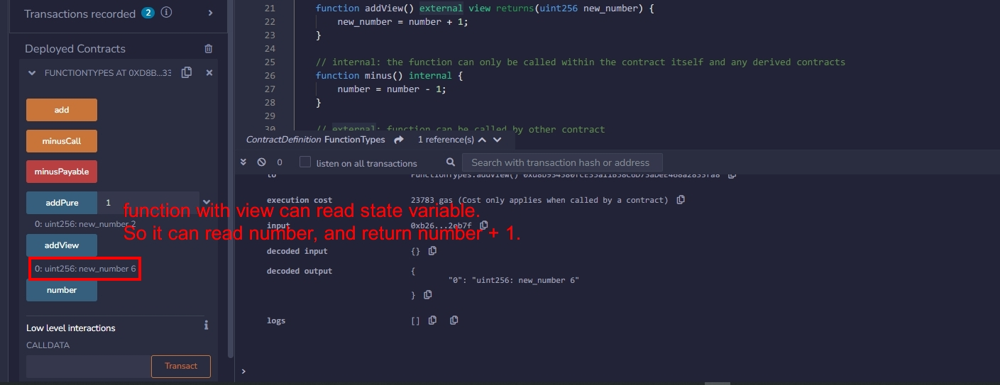
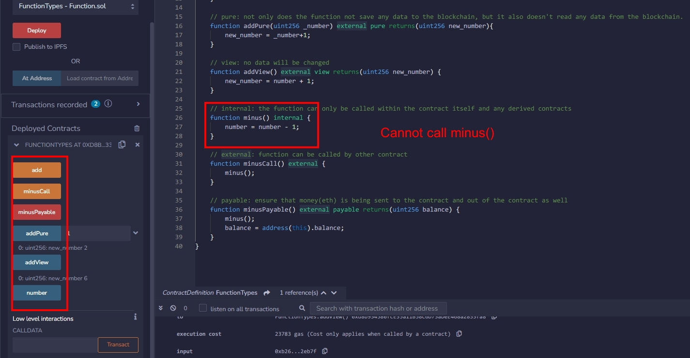

# WTF Solidity: 3. Function

<LessonProcess meta={require('./meta.json')} />

Recently, I have been revisiting Solidity, consolidating the finer details, and writing "WTF Solidity" tutorials for newbies. 

Twitter: [@0xAA_Science](https://twitter.com/0xAA_Science) | [@WTFAcademy_](https://twitter.com/WTFAcademy_)

Community: [Discord](https://discord.gg/5akcruXrsk)｜[Wechat](https://docs.google.com/forms/d/e/1FAIpQLSe4KGT8Sh6sJ7hedQRuIYirOoZK_85miz3dw7vA1-YjodgJ-A/viewform?usp=sf_link)｜[Website wtf.academy](https://wtf.academy)

Codes and tutorials are open source on GitHub: [github.com/AmazingAng/WTFSolidity](https://github.com/AmazingAng/WTFSolidity)


---

## Function

Here's the format of a function in Solidity:

```solidity
    function <function name>(<parameter types>) [internal|external] [pure|view|payable] [returns (<return types>)]
```

It may seem complex, but let's break it down piece by piece (square brackets indicate optional keywords):


1. `function`: To write a function, you need to start with the keyword `function`.

2. `<function name>`: The name of the function.

3. `(<parameter types>)`: The input parameter types and names.

3. `[internal|external|public|private]`: Function visibility specifiers. There are 4 kinds of them `public` is the default visibility if left empty:

   - `public`: Visible to all.

   - `private`: Can only be accessed within this contract, derived contracts cannot use it.

   - `external`: Can only be called from other contracts. But can also be called by `this.f()` inside the contract, where `f` is the function name. 

   - `internal`: Can only be accessed internal and by contracts deriving from it.

    **Note 1**: `public` is the default visibility for functions.
    
    **Note 2**: `public|private|internal` can be also used on state variables. Public variables will automatically generate `getter` functions for querying values. 
    
    **Note 2**: The default visibility for state variables is `internal`.

4. `[pure|view|payable]`: Keywords that dictate a Solidity functions behavior. `payable` is easy to understand. One can send `ETH` to the contract via `payable` functions. `pure` and `view` are introduced in the next section.

5. `[returns (<return types>)]`: Return variable types and names.

## WTF is `Pure` and `View`?

When I started learning `solidity`, I didn't understand `pure` and `view` at all, since they are not common in other languages. `solidity` added these two keywords, because of `gas fee`. The contract state variables are stored on block chain, and `gas fee` is very expensive. If you don't rewrite these variables, you don't need to pay `gas`. You don't need to pay `gas` for calling  `pure` and `view` functions.

The following statements are considered modifying the state:

1. Writing to state variables.

2. Emitting events.

3. Creating other contracts.

4. Using selfdestruct.

5. Sending Ether via calls.

6. Calling any function not marked view or pure.

7. Using low-level calls.

8. Using inline assembly that contains certain opcodes.


I drew a Mario cartton to visualize `pure` and `view`. In the picture, the state variable is represented by Princess Peach, keywards are represented by three different characters.


- `pure` : Functions containing `pure` keyword cannot read nor write state variables on-chain. Just like the little monster, it can't see or touch Princess Peach.

- `view` : Functions containing `view` keyword can read but cannot write on-chain state variables. Similar to Mario, able to see Princess but cannot touch.

- Without `pure` and `view`: Functions can both read and write state variables. Like the `boss` can do whatever he wants.

## Code

### 1. pure v.s. view

We define a state variable `number = 5`

```solidity
    // SPDX-License-Identifier: MIT
    pragma solidity ^0.8.4;
    contract FunctionTypes{
        uint256 public number = 5;
```

Define an `add()` function, add 1 to `number` on every call.

```solidity
    // default
    function add() external{
        number = number + 1;
    }
```

If `add()` contains `pure` keyword, i.e. `function add() pure external`, it will result in an error. Because `pure` cannot read state variable in contract nor write. So what can `pure` do ? i.e. you can pass a parameter `_number` to function, let function returns `_number + 1`.

```solidity
    // pure
    function addPure(uint256 _number) external pure returns(uint256 new_number){
        new_number = _number+1;
    }
```

**Example:**


If `add()` contains `view` , i.e. `function add() view external`, it will also result in error. Because `view` can read, but cannot write state variable. We can modify the function as follows:

```solidity
    // view
    function addView() external view returns(uint256 new_number) {
        new_number = number + 1;
    }
```

**Example:**


### 2. internal v.s. external

```solidity
    // internal
    function minus() internal {
        number = number - 1;
    }

    // external
    function minusCall() external {
        minus();
    }
```

Here we defined an `internal minus()` function, `number` will decrease 1 each time function is called. Since `internal` function can only be called within the contract itself. Therefore, we need to define an `external` `minusCall()` function to call `minus()` internally.

**Example:**


### 3. payable

```solidity
    // payable: money (ETH) can be sent to the contract via this function
    function minusPayable() external payable returns(uint256 balance) {
        minus();
        balance = address(this).balance;
    }
```

We defined an `external payable minusPayable()` function, which calls `minus()` and return `ETH` balance of the current contract (`this` keyword can let us query current contract address). Since the function is `payable`, we can send 1 `ETH` to the contract when calling `minusPayable()`.


We can see that contract balance is 1 `ETH` in return message.


**Example:**


## Coding Exercise

[SoLive](https://solive.wtf) The first open-source lightweight Solidity IDE that can be easily integrated into websites, documents, and tutorials. Powered by WTF Academy, Inspired by Remix-IDE and react-live.

Try to complete the following contract and make it compile!

```solidity solive height=400px
// SPDX-License-Identifier: MIT
pragma solidity ^0.8.4;
contract Quiz3{
    // complete following funciton, let it return the sum of x and y 
    function sum(uint x, uint y) external{

    }
}
```


## Summary

In this section, we introduced `solidity` function type. `pure` and `view` keywords are difficult to understand, since they are not common in other languages. You don't need to pay gas fees for calling `pure` or `view` functions, since they don't modify the on-chain data.
<LessonQuizStart meta={require('./meta.json')} />
