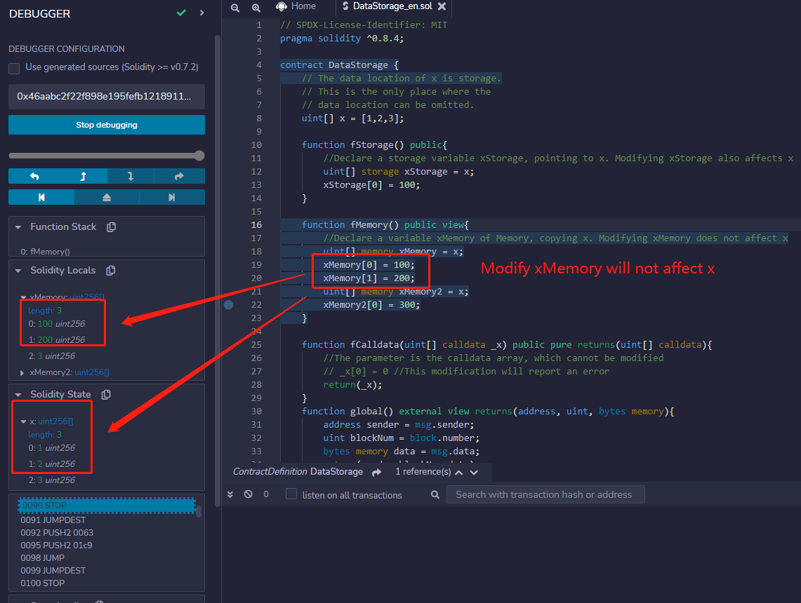

# WTF Solidity: 5. Data Storage and Scope

<LessonProcess meta={require('./meta.json')} />

Recently, I have been relearning Solidity, consolidating the finer details, and also writing a "WTF Solidity Tutorial" for newbies to learn. Lectures are updated 1~3 times weekly. 

Everyone is welcomed to follow my Twitter: [@0xAA_Science](https://twitter.com/0xAA_Science)

WTF Academy Discord: [Link](https://discord.gg/5akcruXrsk)

All codebase and tutorial notes are open source and available on GitHub (At 1024 repo stars, course certification is unlocked. At 2048 repo stars, community NFT is unlocked.): [github.com/AmazingAng/WTFSolidity](https://github.com/AmazingAng/WTFSolidity)

-----

## Reference types in Solidity
**Reference Type**: Reference types differ from value types in that they do not store values directly on their own. Instead, reference types store the address/pointer of the data’s location and do not directly share the data. You can modify the underlying data with different variable names. Reference types `array`, `struct` and `mapping`, which take up a lot of storage space. We need to deal with the location of the data storage when using them.

## Data location
There are three types of data storage locations in solidity: `storage`, `memory` and `calldata`. Gas costs are different for different storage locations. 

The data of a `storage` variable is stored on-chain, similar to the hard disk of a computer, and consumes a lot of `gas`; while the data of `memory` and `calldata` variables are temporarily stored in memory, consumes less `gas`. 

General usage:

1. `storage`: The state variables are `storage` by default, which are stored on-chain. 

2. `memory`: The parameters and temporary variables in the function generally use `memory` label, which is stored in memory and not on-chain. 

3. `calldata`: Similar to `memory`, stored in memory, not on-chain. The difference from `memory` is that `calldata` variables cannot be modified, and is generally used for function parameters. Example:

```solidity
    function fCalldata(uint[] calldata _x) public pure returns(uint[] calldata){
        //The parameter is the calldata array, which cannot be modified.
        // _x[0] = 0 //This modification will report an error.
        return(_x);
    }
```

**Example:**


### Data location and assignment behaviour

Data locations are not only relevant for persistency of data, but also for the semantics of assignments:

1. When `storage` (a state variable of the contract) is assigned to the local `storage` (in a function), a reference will be created, and changing value of the new variable will affect the original one. Example:
```solidity
    uint[] x = [1,2,3]; // state variable: array x

    function fStorage() public{
        //Declare a storage variable xStorage, pointing to x. Modifying xStorage will also affect x
        uint[] storage xStorage = x;
        xStorage[0] = 100;
    }
```
**Example:**


2. Assigning `storage` to `memory` creates independent copies, and changes to one will not affect the other; and vice versa. Example:
```solidity
    uint[] x = [1,2,3]; // state variable: array x
    
    function fMemory() public view{
        //Declare a variable xMemory of Memory, copy x. Modifying xMemory will not affect x
        uint[] memory xMemory = x;
        xMemory[0] = 100;
    }
```
**Example:**


3. Assigning `memory` to `memory` will create a reference, and changing the new variable will affect the original variable.

4. Otherwise, assigning a variable to `storage` will create independent copies, and modifying one will not affect the other.

## Variable scope
There are three types of variables in `Solidity` according to their scope: state variables, local variables, and global variables.

### 1. State variables
State variables are variables whose data is stored on-chain and can be accessed by in-contract functions, but their `gas` consumption is high. 

State variables are declared inside the contract and outside the functions:
```solidity
contract Variables {
    uint public x = 1;
    uint public y;
    string public z;
```

We can change the value of the state variable in a function:

```solidity
    function foo() external{
        // You can change the value of the state variable in the function
        x = 5;
        y = 2;
        z = "0xAA";
    }
```

### 2. Local variable
Local variables are variables that are only valid during function execution; they are invalid after function exit. The data of local variables are stored in memory, not on-chain, and their `gas` consumption is low. 

Local variables are declared inside a function:
```solidity
    function bar() external pure returns(uint){
        uint xx = 1;
        uint yy = 3;
        uint zz = xx + yy;
        return(zz);
    }
```

### 3. Global variable
Global variables are variables that work in the global scope and are reserved keywords for `solidity`. They can be used directly in functions without declaring them:

```solidity
    function global() external view returns(address, uint, bytes memory){
        address sender = msg.sender;
        uint blockNum = block.number;
        bytes memory data = msg.data;
        return(sender, blockNum, data);
    }
```
In the above example, we use three global variables: `msg.sender`, `block.number` and `msg.data`, which represent the sender of the message (current call), current block height, and complete calldata. 

Below are some commonly used global variables:

- `blockhash(uint blockNumber)`: (`bytes32`)         The hash of the given block - only applies to the 256 most recent block. 
- `block.coinbase`             : (`address payable`) The address of the current block miner
- `block.gaslimit`             : (`uint`)            The gaslimit of the current block
- `block.number`               : (`uint`)            Current block number
- `block.timestamp`            : (`uint`)            The timestamp of the current block, in seconds since the unix epoch
- `gasleft()`                  : (`uint256`)         Remaining gas
- `msg.data`                   : (`bytes calldata`)  Complete calldata
- `msg.sender`                 : (`address payable`) Message sender (current caller)
- `msg.sig`                    : (`bytes4`)          first four bytes of the calldata (i.e. function identifier)
- `msg.value`                  : (`bytes4`)          number of wei sent with the message

**Example:**


## Summary
In this chapter, we introduced reference types, data storage locations and variable scopes in `solidity`. There are three types of data storage locations: `storage`, `memory` and `calldata`. Gas costs are different for different storage locations. The variable scope include state variables, local variables and global variables.
<LessonQuizStart meta={require('./meta.json')} />
